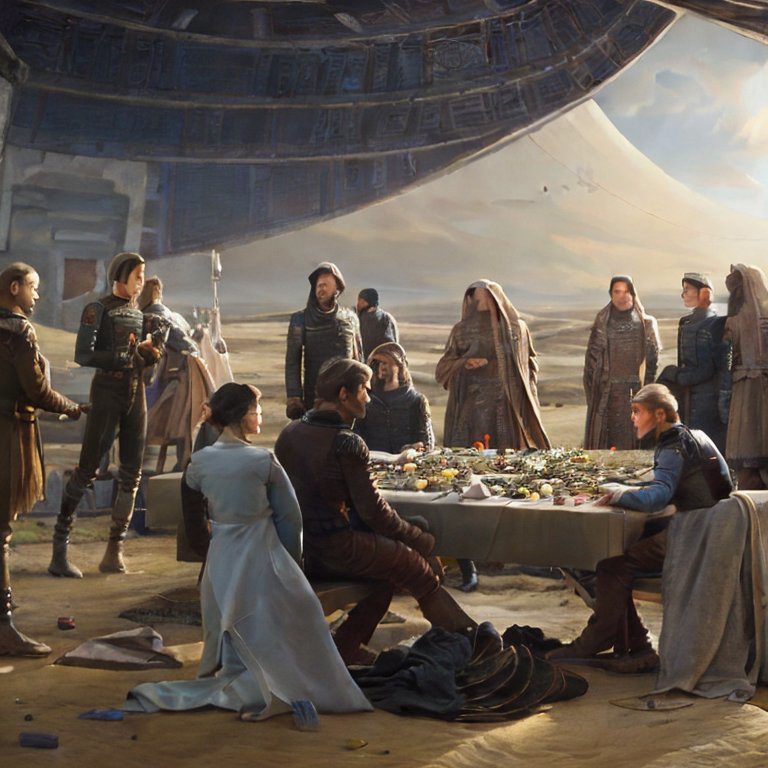
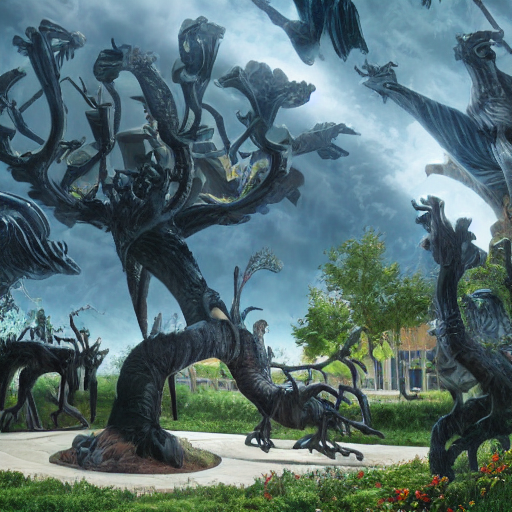
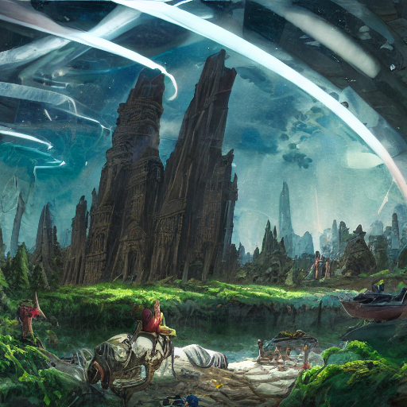

# Substrate

𝘘𝘶𝘢𝘳𝘵𝘪𝘤 𝘙𝘪𝘯𝘨 𝘍𝘪𝘦𝘭𝘥𝘴

# Fractal Teleology

𝘈𝘯𝘪𝘮𝘰 𝘗𝘰𝘵𝘦𝘯𝘴, 𝘡𝘦𝘭𝘶𝘴 𝘐𝘯𝘤𝘰𝘳𝘳𝘶𝘱𝘵𝘶𝘴

and

𝘐𝘵𝘦𝘳 𝘊𝘩𝘳𝘰𝘯𝘰𝘭𝘰𝘨𝘪𝘤𝘶𝘮 𝘈𝘣 𝘔𝘦𝘮𝘰𝘳𝘪𝘪𝘴 𝘈𝘯𝘵𝘪𝘲𝘶𝘪𝘴 𝘈𝘥 𝘚𝘰𝘮𝘯𝘪𝘢 𝘍𝘶𝘵𝘶𝘳𝘢


```bash

C:\> nvidia-smi

Thu Dec 21 17:50:00 2023
+---------------------------------------------------------------------------------------+
| NVIDIA-SMI 545.36                 Driver Version: 546.33       CUDA Version: 12.3     |
|-----------------------------------------+----------------------+----------------------+
| GPU  Name                 Persistence-M | Bus-Id        Disp.A | Volatile Uncorr. ECC |
| Fan  Temp   Perf          Pwr:Usage/Cap |         Memory-Usage | GPU-Util  Compute M. |
|                                         |                      |               MIG M. |
|=========================================+======================+======================|
|   0  NVIDIA GeForce RTX 3060        On  | 00000000:01:00.0  On |                  N/A |
|  0%   33C    P8              17W / 170W |    709MiB / 12288MiB |      9%      Default |
|                                         |                      |                  N/A |
+-----------------------------------------+----------------------+----------------------+

+---------------------------------------------------------------------------------------+
| Processes:                                                                            |
|  GPU   GI   CI        PID   Type   Process name                            GPU Memory |
|        ID   ID                                                             Usage      |
|=======================================================================================|
|    0   N/A  N/A        23      G   /Xwayland                                 N/A      |
+---------------------------------------------------------------------------------------+
```

Using sd-v1–4 checkpoint.


Based on:
Stable Diffusion Quickstart with WSL2 and RTX3070  <br>
https://koyaaarr.medium.com/stable-diffusion-quickstart-withwsl2-and-rtx3070-e8f4e75a47a4


# Ab Urbe Condita

## Seed

|      |      |      |      |      |
| ---- | ---- | ---- | ---- | ---- |
|  |  |  |  |  |

## Yield

|      |      |      |      |      |
| ---- | ---- | ---- | ---- | ---- |
|  |  |  |  |


# Feature Preview

## Universal

|      |      |      |      |      |
| ---- | ---- | ---- | ---- | ---- |
|  |  |  |  |  |
|  |  |  |  |  |

𝘛𝘳𝘢𝘫𝘦𝘤𝘵𝘰𝘳𝘺 51

## Entropy


|      |      |      |      |      |
| ---- | ---- | ---- | ---- | ---- |
|  |  |  |  |  |
|  |  |  |  |  |

𝘛𝘳𝘢𝘫𝘦𝘤𝘵𝘰𝘳𝘺 52


# Exemplia Gratia

Download Source Images - 400 MB

🧲Magnet Link:  <br>
http://tinyurl.com/94a2v8sd
